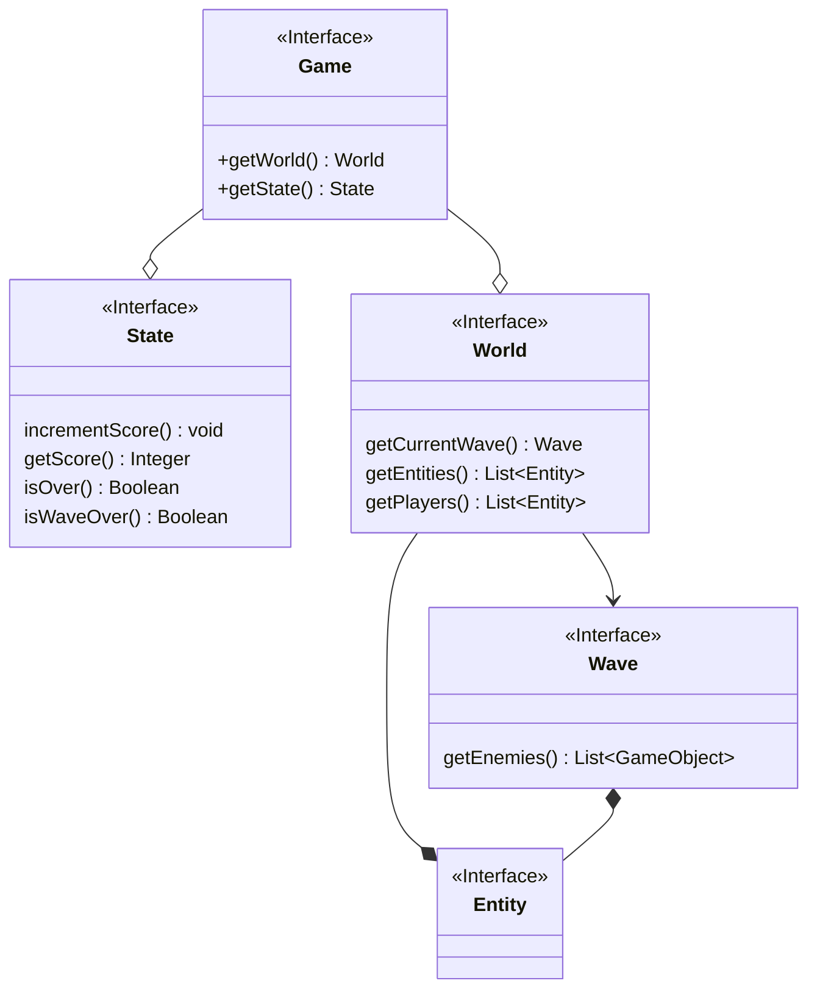

```mermaid
classDiagram
%% Relations
Game --o State
Game --o World
World --> Wave
World --* Entity
Wave *-- Entity
s
class Game{
    <<Interface>>
    +getWorld() World
    +getState() State
}
class World{
    <<Interface>>
    getCurrentWave() Wave
    getEntities() List~Entity~
    getPlayers() List~Entity~
}
class State{
    <<Interface>>
    incrementScore() void
    getScore() Integer
    isOver() Boolean
    isWaveOver() Boolean
}
class Wave{
    <<Interface>>
    getEnemies() List~GameObject~
}
class Entity{
    <<Interface>>
}

```