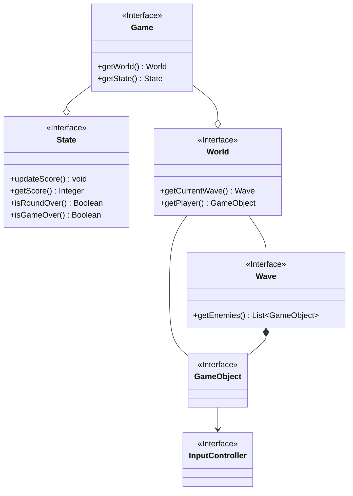

```mermaid
classDiagram
%% Relations
Game --o State
Game --o World
World -- Wave
World -- GameObject
Wave *-- GameObject
GameObject --> InputController

class Game{
    <<Interface>>
    +getWorld() World
    +getState() State
}
class World{
    <<Interface>>
    +getCurrentWave() Wave
    +getPlayer() GameObject
}
class State{
    <<Interface>>
    +updateScore() void
    +getScore() Integer
    +isRoundOver() Boolean
    +isGameOver() Boolean
}
class Wave{
    <<Interface>>
    +getEnemies() List~GameObject~
}
class GameObject{
    <<Interface>>
}
class InputController{
    <<Interface>>
}
```