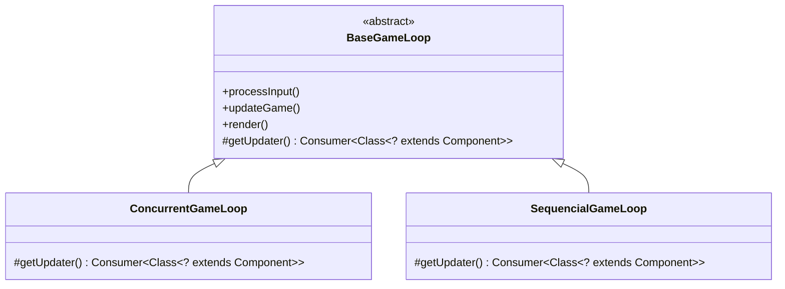

```mermaid
classDiagram

    BaseGameLoop <|-- ConcurrentGameLoop
    BaseGameLoop <|-- SequencialGameLoop

    class BaseGameLoop{
        <<abstract>>
        +processInput()
        +updateGame()
        +render()
        #getUpdater() Consumer~Class~? extends Component~~
    }

    class ConcurrentGameLoop{
        #getUpdater() Consumer~Class~? extends Component~~
    }

    class SequencialGameLoop{
        #getUpdater() Consumer~Class~? extends Component~~
    }

```