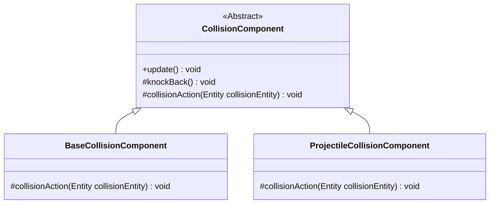

```mermaid
classDiagram

CollisionComponent <|-- BaseCollisionComponent
CollisionComponent <|-- ProjectileCollisionComponent

class CollisionComponent {
    <<Abstract>>
    +update() void
    #knockBack() void
    #collisionAction(Entity collisionEntity) void
}

class BaseCollisionComponent {
    #collisionAction(Entity collisionEntity) void
}

class ProjectileCollisionComponent {
    #collisionAction(Entity collisionEntity) void
}

```