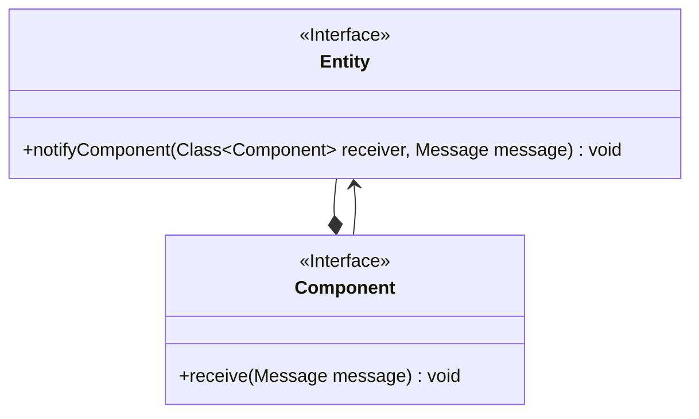

```mermaid
classDiagram

Entity --* Component
Entity <-- Component

class Entity {
    <<Interface>>
    +notifyComponent(Class~Component~ receiver, Message message) void
}

class Component {
    <<Interface>>
    +receive(Message message) void
}

```