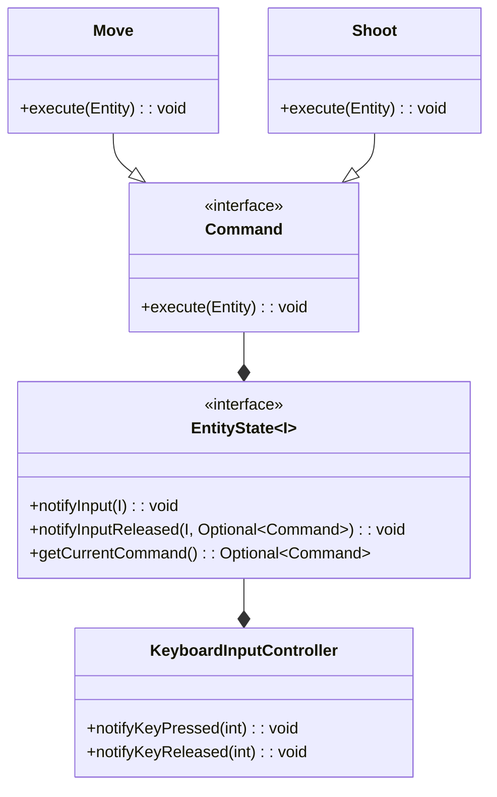

```mermaid
classDiagram

EntityState~I~ --* KeyboardInputController
Command --* EntityState~I~
Move --|> Command
Shoot --|> Command

class KeyboardInputController {
    +notifyKeyPressed(int): void
    +notifyKeyReleased(int): void
}
%%
class EntityState~I~ {
    <<interface>>
    +notifyInput(I): void
    +notifyInputReleased(I, Optional~Command~): void
    +getCurrentCommand(): Optional~Command~
}
%%
class Command {
    <<interface>>
    +execute(Entity): void
}
%%
class Move {
    +execute(Entity): void
}
%%
class Shoot {
    +execute(Entity): void
}
```