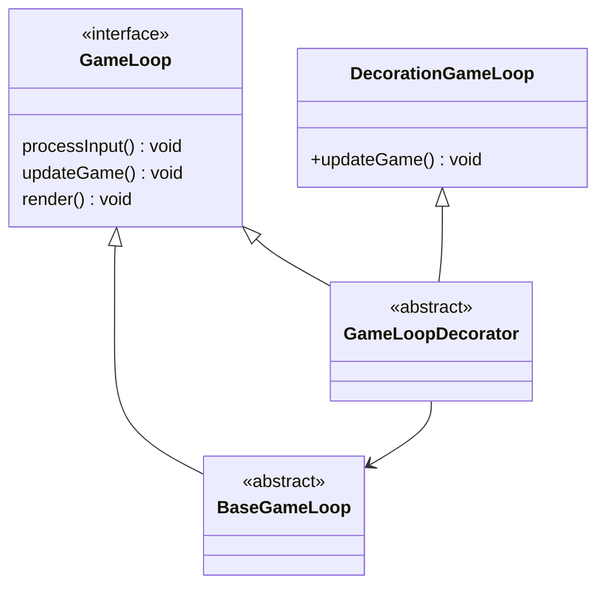

```mermaid
classDiagram


GameLoop <|-- BaseGameLoop
GameLoop <|-- GameLoopDecorator
GameLoopDecorator --> BaseGameLoop 

DecorationGameLoop <|-- GameLoopDecorator

    class GameLoop{
        <<interface>>
        processInput() void
        updateGame() void
        render() void
    }

    class BaseGameLoop{
        <<abstract>>
    }

    class GameLoopDecorator{
        <<abstract>>
    }
    

    class DecorationGameLoop{
        +updateGame() void
    }


```
