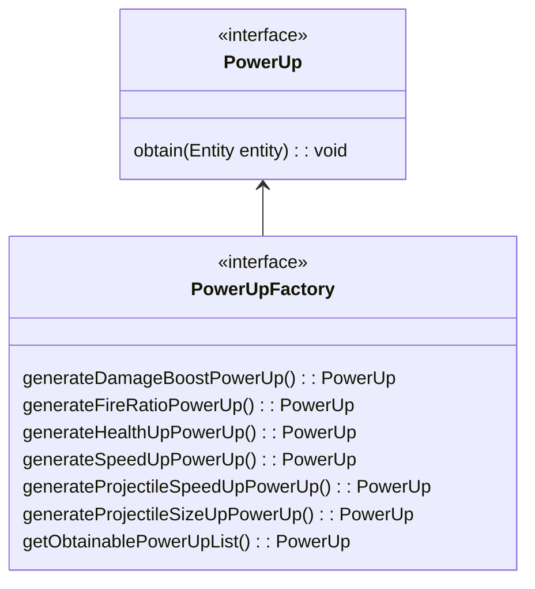

```mermaid
classDiagram

PowerUp <-- PowerUpFactory 

class PowerUp {
    <<interface>>
    obtain(Entity entity): void
}
%%
class PowerUpFactory {
    <<interface>>
    generateDamageBoostPowerUp(): PowerUp
    generateFireRatioPowerUp(): PowerUp
    generateHealthUpPowerUp(): PowerUp
    generateSpeedUpPowerUp(): PowerUp
    generateProjectileSpeedUpPowerUp(): PowerUp
    generateProjectileSizeUpPowerUp(): PowerUp
    getObtainablePowerUpList(): PowerUp
}
%%
```
