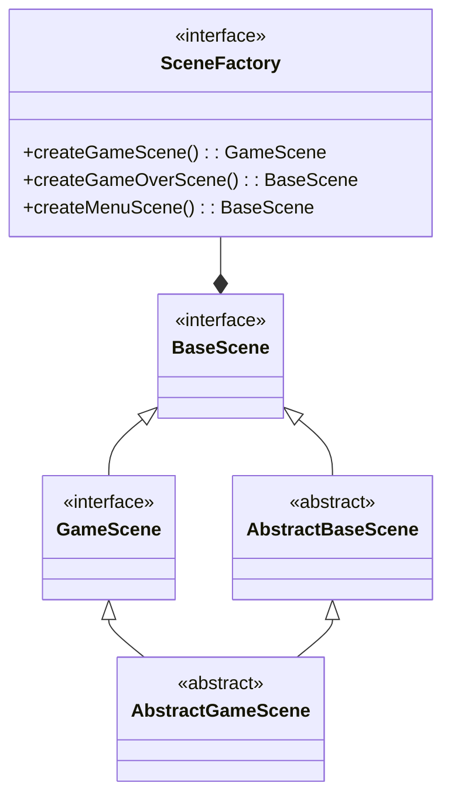

```mermaid
classDiagram
BaseScene <|-- AbstractBaseScene
BaseScene <|-- GameScene
GameScene <|-- AbstractGameScene
AbstractBaseScene <|-- AbstractGameScene
SceneFactory --* BaseScene


class BaseScene {
    <<interface>>

}

class GameScene {
    <<interface>>

}

class AbstractBaseScene {
    <<abstract>>
}

class AbstractGameScene {
    <<abstract>>
}

class SceneFactory {
    <<interface>>
    +createGameScene(): GameScene
    +createGameOverScene(): BaseScene
    +createMenuScene(): BaseScene
}
```