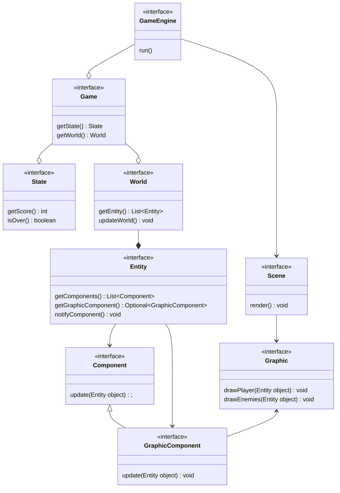

```mermaid
classDiagram

GameEngine --o Game 
GameEngine --> Scene
Game --o  State
Game --o World
World --* Entity
Entity --> Component
Component <|-- GraphicComponent
Scene --> Graphic
GraphicComponent <-- Entity
Graphic <-- GraphicComponent

%% Rapresenting the MVC's "Model"
%% Every thing in the model is a Entity
class Entity{
    <<interface>>
    getComponents() List~Component~
    getGraphicComponent() Optional~GraphicComponent~
    notifyComponent() void
}
%%
class Component{
    <<interface>>
    update(Entity object);
}
%%
class GraphicComponent{
    <<interface>>
    update(Entity object) void
}
%% Rapresenting the MVC's "Controller"
class GameEngine{
    <<interface>>
    run() 
}
%% Rapresenting the current game of the player
class Game{
    <<interface>>
    getState() State
    getWorld() World
}
%% State of a Game
class State{
    <<interface>>
    getScore() int
    isOver() boolean
}
%% Basically a "Container" for all Entitys
class World{
    <<interface>>
    getEntity() List~Entity~
    updateWorld() void
}
%% Rapresenting the MVC's "View" 
class Scene{
    <<interface>>
    render() void
}
%% 
class Graphic{
    <<interface>>
    drawPlayer(Entity object) void
    drawEnemies(Entity object) void
}
%% 
```