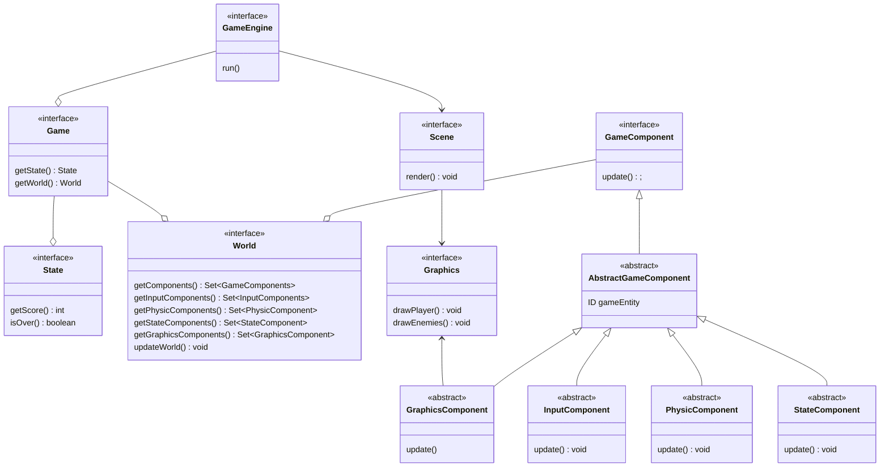

```mermaid
classDiagram

GameEngine --o Game 
GameEngine --> Scene
Game --o  State
Game --o World
GameComponent --o World


Scene --> Graphics
Graphics <-- GraphicsComponent

GameComponent <|-- AbstractGameComponent
AbstractGameComponent <|-- GraphicsComponent
AbstractGameComponent <|-- InputComponent
AbstractGameComponent <|-- PhysicComponent
AbstractGameComponent <|-- StateComponent

%% Rapresenting the MVC's "Model"
%% Every thing in the model is a GameObject
%%
class AbstractGameComponent{
    <<abstract>>
    ID gameEntity
}
class GameComponent{
    <<interface>>
    update();
}
%%
%%

class InputComponent{
    <<abstract>>
    update() void
}
class PhysicComponent{
    <<abstract>>
    update() void
}
class StateComponent{
    <<abstract>>
    update() void
}
class GraphicsComponent{
    <<abstract>>
    update()
}
%% Rapresenting the MVC's "Controller"
class GameEngine{
    <<interface>>
    run() 
}
%% Rapresenting the current game of the player
class Game{
    <<interface>>
    getState() State
    getWorld() World
}
%% State of a Game
class State{
    <<interface>>
    getScore() int
    isOver() boolean
}
%% Basically a "Container" for all GameObjects
class World{
    <<interface>>
    getComponents() Set~GameComponents~
    getInputComponents() Set~InputComponents~
    getPhysicComponents() Set~PhysicComponent~
    getStateComponents() Set~StateComponent~
    getGraphicsComponents() Set~GraphicsComponent~
    updateWorld() void
}
%% Rapresenting the MVC's "View" 
class Scene{
    <<interface>>
    render() void
}
%% 
class Graphics{
    <<interface>>
    drawPlayer() void
    drawEnemies() void
}
%% 


```