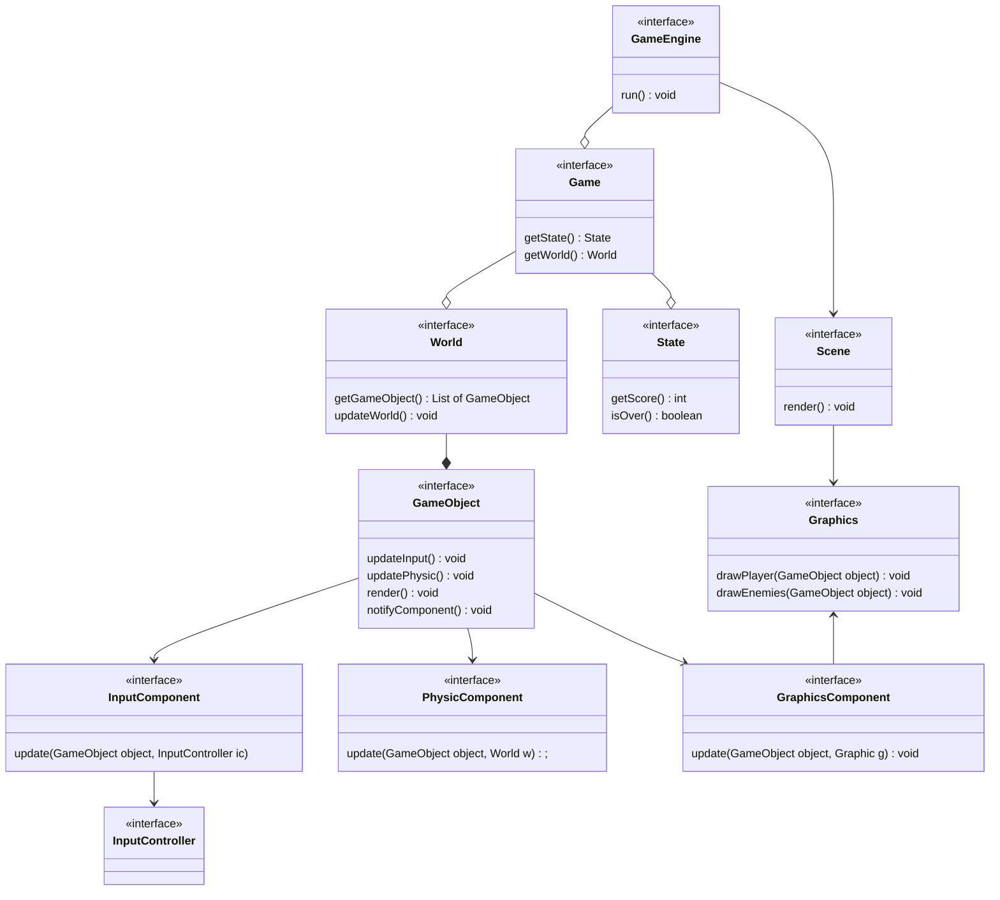

```mermaid
classDiagram

GameEngine --o Game 
GameEngine --> Scene
Game --o  State
Game --o World
World --* GameObject
GameObject --> InputComponent
GameObject --> PhysicComponent
GameObject --> GraphicsComponent
InputComponent --> InputController
Scene --> Graphics
Graphics <-- GraphicsComponent

%% Rapresenting the MVC's "Model"
%% Every thing in the model is a GameObject
class GameObject{
    <<interface>>
    updateInput() void
    updatePhysic() void
    render() void
    notifyComponent() void
}
%%
class InputComponent{
    <<interface>>
    update(GameObject object, InputController ic)
}
%%
class PhysicComponent{
    <<interface>>
    update(GameObject object, World w);
}
%%
class GraphicsComponent{
    <<interface>>
    update(GameObject object, Graphic g) void
}
%%
class InputController{
    <<interface>>
}
%%
%% Rapresenting the MVC's "Controller"
class GameEngine{
    <<interface>>
    run() void
}
%% Rapresenting the current game of the player
class Game{
    <<interface>>
    getState() State
    getWorld() World
}
%% State of a Game
class State{
    <<interface>>
    getScore() int
    isOver() boolean
}
%% Basically a "Container" for all GameObjects
class World{
    <<interface>>
    getGameObject() List of GameObject
    updateWorld() void
}
%% Rapresenting the MVC's "View" 
class Scene{
    <<interface>>
    render() void
}
%% 
class Graphics{
    <<interface>>
    drawPlayer(GameObject object) void
    drawEnemies(GameObject object) void
}
%% 


```