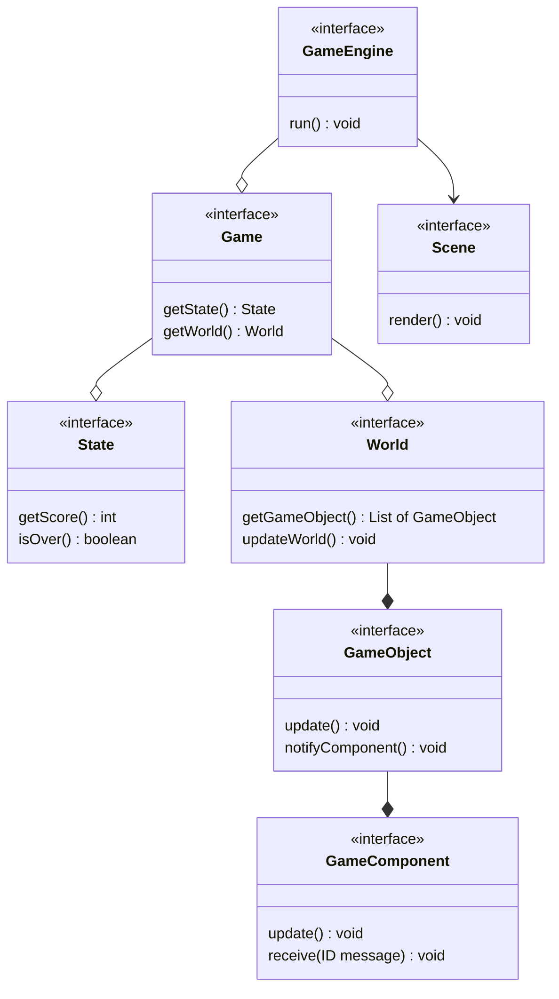

```mermaid
classDiagram

GameEngine --o Game 
GameEngine --> Scene
Game --o  State
Game --o World
World --* GameObject
GameObject --* GameComponent

%% Rapresenting the MVC's "Model"
%% Every thing in the model is a GameObject
class GameObject{
    <<interface>>
    update() void
    notifyComponent() void
}
%% We can add domain, in a decouple way, to a GameObject
class GameComponent{
    <<interface>>
    update() void
    receive(ID message) void
}
%% Rapresenting the MVC's "Controller"
class GameEngine{
    <<interface>>
    run() void
}
%% Rapresenting the current game of the player
class Game{
    <<interface>>
    getState() State
    getWorld() World
}
%% State of a Game
class State{
    <<interface>>
    getScore() int
    isOver() boolean
}
%% Basically a "Container" for all GameObjects
class World{
    <<interface>>
    getGameObject() List of GameObject
    updateWorld() void
}
%% Rapresenting the MVC's "View" 
class Scene{
    <<interface>>
    render() void
}
```