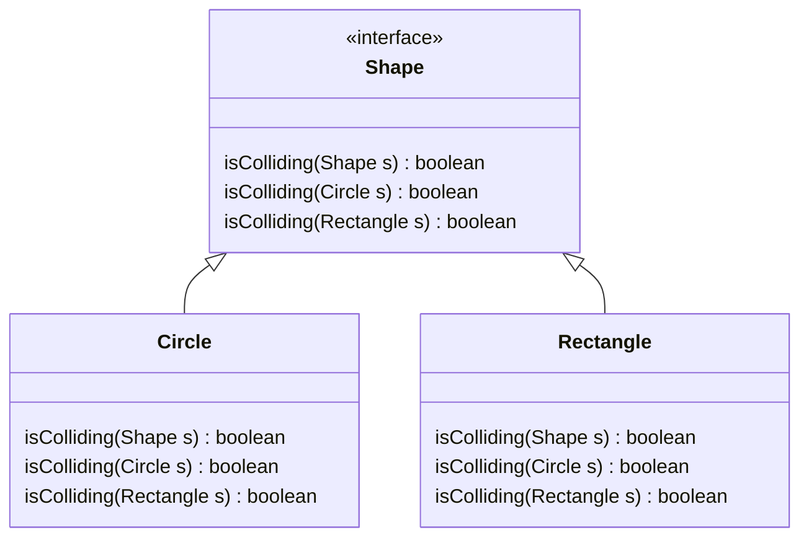

```mermaid
classDiagram

    Shape <|-- Circle
    Shape <|-- Rectangle

    class Shape{
        <<interface>>
        isColliding(Shape s) boolean
        isColliding(Circle s) boolean
        isColliding(Rectangle s) boolean
    }

    class Circle{
        isColliding(Shape s) boolean
        isColliding(Circle s) boolean
        isColliding(Rectangle s) boolean
    }

    class Rectangle{
        isColliding(Shape s) boolean
        isColliding(Circle s) boolean
        isColliding(Rectangle s) boolean
    }
```