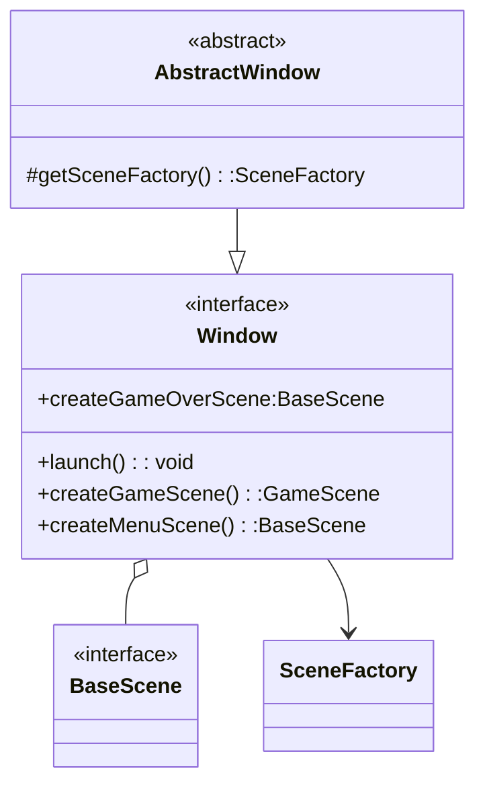

```mermaid
classDiagram
AbstractWindow --|> Window
Window o-- BaseScene
Window --> SceneFactory

class Window {
    <<interface>>
    +launch(): void
    +createGameScene():GameScene
    +createMenuScene():BaseScene
    +createGameOverScene:BaseScene
}

class AbstractWindow {
    <<abstract>>
    #getSceneFactory():SceneFactory
}

class BaseScene {
    <<interface>>
}
```